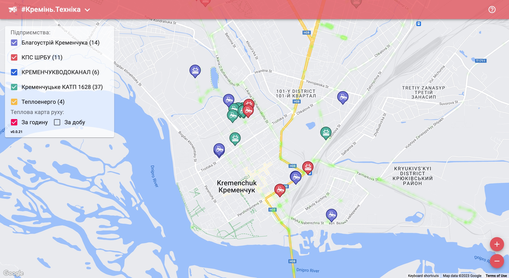

# #Kremen.Equipment - Web

Map of municipal vehicles: snowplows, sprinklers, and tractors in Kremenchuk City, Ukraine.

- **GitHub:** [Web](https://github.com/husky-dev/kremen-equipment-web), [API](https://github.com/husky-dev/kremen-api)
- **Apps:** [Web](https://equipment.kremen.dev)

The idea for this project came up in the winter when I wanted to find out which areas are effectively cleaned of snow and which are not. The [Kremenchuk City Council website](https://kremen.gov.ua/) has a map of the movement of municipal equipment, but it doesn't allow you to view the history. Additionally, it would be nice to see a heat map of the equipment's work so you can visually see how your neighborhood was cleaned throughout the day. That's how this app came about.

It uses the same technology stack as [\#Kremen.Transport](https://github.com/husky-dev/kremen-transport-web): MongoDB for logging movements and Redis for caching data.

- **Web:** React, TypeScript, ESBuild.
- **Mobile:** React Native, TypeScript.
- **API:** NodeJS, TypeScript, Docker, Docker Compose, Redis, MongoDB.

## Contacts

Jaroslav Khorishchenko

[hello@husky-dev.me](mailto:hello@husky-dev.me)
